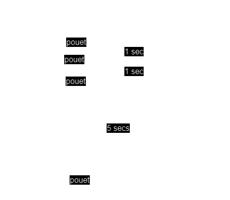
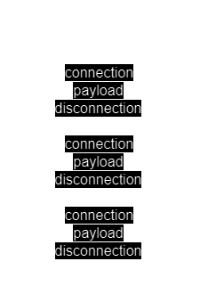

# Laboratoire DAI - Protocole UDP
## Tâche 1
### L'architecture de l'application
L'application est séparée en 2 parties (3 si l'on se compte):
<ul>
    <li>Le musicien</li>
    <li>L'auditeur</li>
</ul>
la partie du musicien va premièrement servir à définir l'instrument, qui sera joué. L'instrument sera décidé à la création du container, et chaque container "instrument" contiendra un dictionnaire ayant comme key-value le nom et le bruit, respectivement.<br>
Chacun enverra toutes les secondes des packets UDP sur le port à l'auditeur, contenant l'uuid et le son correspondant.<br>
<br>
La partie auditeur, elle, va fonctionner avec 3 threads: le principal, et 2 virtual threads. Un virtual thread va s'occuper de recevoir les packets UDP contenant le son, déterminer de quel instrument ça vient grâce à un dictionnaire (qui pourrait inverser la key-value), et mettre à jour le timestamp de la dernière activité du musicien, s'il a déjà été ajouté auparavant (l'ajoute autrement). Le deuxième virtual thread va quant à lui envoyer un packet TCP avec comme payload un json contenant l'uuid du musicien, le nom de l'instrument, et le timestamp correspondant à la dernière mise à jour du musicien au client qui aura éventuellement établi une connexion. Pour finir, le main thread est celui qui va s'occuper des musicien stockés, afin de voir lesquels sont encore considérés comme actifs.

### Le design des protocoles
#### UDP
UDP est un protocole qui va s'envoyer à sens unique. Il va partir de musician pour atteindre l'auditeur. Musicien va envoyer ses packets UDP via le port 9904.
Étant-donné qu'un serveur UDP n'attend pas de réponse au packet envoyé, l'auditeur ne va pas répondre à ces packets, et va se contenter de voir depuis combien de temps un musicien n'a pas refait de son. Si > 5 secs, le musicien sera considéré comme inactif. <br>
Les packets envoyés auront comme body un payload du type <br>
```json
{
    "uuid": "67ada557-547e-41f0-a7c1-ea743c756a41",
    "sound": "pouet"
}
```
##### Exemple de dialogue
<br>
(note à moi-même: Pas besoin d'un format donnant plusieurs instruments, puisqu'un instrument est un container. Chaque instrument envoie donc son propre son).

#### TCP
L'auditeur va écouter sur le port 2205 si une connexion est entrante (unicast). Quand une connexion sera établie, il enverra un packet TCP via cette connexion contenant la liste de musiciens actifs, et refermera la connexion aussitôt.<br>
Le TCP contiendra un payload au format JSON comme suit:
```json
[
  {
  	"uuid" : "aa7d8cb3-a15f-4f06-a0eb-b8feb6244a60",
  	"instrument" : "piano",
  	"lastActivity" : <Datetime or Timestamp as long>
  },
  {
  	"uuid" : "06dbcbeb-c4c8-49ed-ac2a-cd8716cbf2d3",
  	"instrument" : "flute",
  	"lastActivity" : <Datetime or Timestamp as long>
  }
]
```
qui contiendra chaque instrument décrit par son nom et son uuid.
##### Exemple de dialogue
